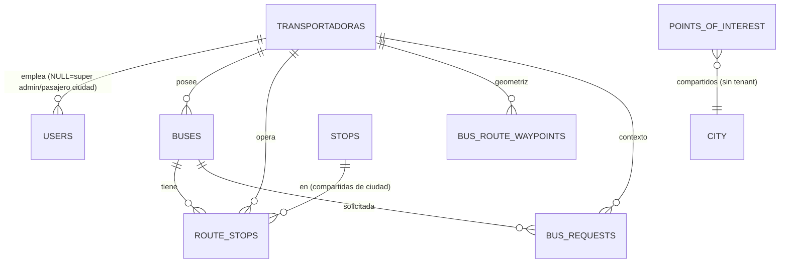

# 🗄️ DB_SCHEMA — Esquema de tenancy (transportadoras + `transportadora_id`)

> M2 · S2.3.2 · Canónico de la parte **tenancy** de `DISEÑO_DB.md` (el documento unificado sigue vivo como referencia de detalle; aquí se fijan las decisiones que M3 implementa). Stack: Laravel 12 / MySQL prod / SQLite dev — debe migrar limpio en ambos.

## 1. Tabla raíz `transportadoras`

```
id · nombre VARCHAR(120) · slug VARCHAR(60) UNIQUE · razon_social VARCHAR(160) NULL
nit VARCHAR(20) UNIQUE NULL · logo_path NULL · contacto_email/telefono NULL
plan VARCHAR(20) default 'trial' · activo BOOL default 1 · timestamps + softDeletes
```
Índices: `UNIQUE(slug)`, `INDEX(activo)`. El estado de suscripción vive en `saas_subscriptions` (fase F4), no aquí.

## 2. Columna tenant en tablas existentes (`add_tenant_to_core_tables`)

| Tabla | Cambio |
|---|---|
| `users` | `transportadora_id` FK NULL — NULL = Super Admin o pasajero de ciudad; admins/conductores llevan tenant. |
| `buses` | `transportadora_id` FK NULL→NOT NULL tras backfill. **Drop de únicos globales `plate` y `external_vehicle_id`** (`2026_04_17_100000_create_buses_table.php:18-19`) y `UNIQUE(transportadora_id, plate)`. |
| `route_stops` | `transportadora_id` (la ruta es de la empresa). |
| `bus_route_waypoints` | `transportadora_id` (geometrías = dato propietario). |
| `bus_requests` | `transportadora_id` + `INDEX(transportadora_id, status)`. |
| `stops`, `points_of_interest` | **SIN FK**: datos compartidos de ciudad (decisión `DISEÑO_DB.md §3`). |

Índice estándar por tabla con tenant: `INDEX(transportadora_id)` + compuestos calientes: `buses(transportadora_id,is_active)`, `route_stops(transportadora_id,bus_id,order)`, `bus_requests(transportadora_id,status)`.

## 3. Reglas de aislamiento

- **GlobalScope propio** (`BelongsToTenant`): aplica `where transportadora_id` SOLO con usuario autenticado con tenant no-NULL; NULL/sin-auth (Super Admin, seeders, consola) = sin scope. Escape `scopeWithoutTenant()`. Auto-set en `creating`.
- Segunda capa: `EnsureTenantScope` en API + policies; 404 silencioso cross-tenant (`BOTTLENECKS.md §1`).
- El scope no cubre query builder puro (`DB::table(...)`) — políticas y middleware obligatorios.

## 4. Backfill (seed/orden)

1. `create_transportadoras_table` → 2. `TransportadoraSeeder`: "Metropolitana UNAB (demo)" (slug `tm-unab-demo`) → 3. `add_tenant_to_core_tables` (nullable+index; swap de únicos) → 4. backfill idempotente: buses/waypoints/route_stops/requests/admins/drivers ← tenant demo; stops/POI/pasajeros quedan NULL. Verificado con `migrate:fresh --seed` en SQLite.

## 5. Roles (relacionado, ADR-002 de `ARCHITECTURE.md`)

`users.role` enum actual `('student','admin','driver')` → ampliado a `('pasajero','student','admin','super_admin','tenant_admin','driver')` con `admin`≡`super_admin` y `student`≡`pasajero` (backward compat, sin rompe a apps instaladas). `users.transportadora_id` = único asiento del tenant.

## 6. Grafo de relaciones (mermaid)



> Decisión de diseño (`DISEÑO_DB.md §3`): `stops` y `points_of_interest` son **datos compartidos de ciudad** — se conectan al tenant solo a través de `route_stops`/`bus_route_waypoints`, que sí llevan `transportadora_id`.

## 7. Matriz SQLite vs MySQL (pegado operativo)


| Aspecto | SQLite (dev) | MySQL 8 (prod) | Mitigación |
|---|---|---|---|
| ENUM | TEXT sin restricción (`2026_04_30_053309_fix_sqlite_roles.php` como precedente) | ENUM real | Validación en modelo |
| FKs | `PRAGMA foreign_keys=ON` (Laravel lo activa) | On | Tests de inserción huérfana |
| `lockForUpdate()` | Omite silenciosamente | InnoDB real | Guardas `WHERE balance>=?` seguras en ambos (`BOTTLENECKS.md §4`) |
| dropUnique | Por nombre generado (`buses_plate_unique`) | Mismo | Verificar contra `sqlite_master`; precedentes en `2026_04_17_300000_*` |
