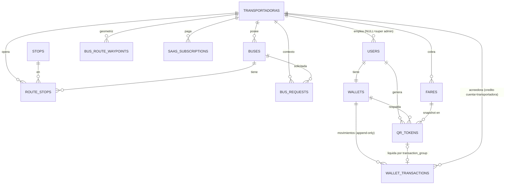

# 🗄️ DISEÑO_DB — Esquema Multi-Tenant "Bucaramanga Mobility"

> Documento de diseño (M2 · S2.1.2). Baseline verificado: 16 migraciones en `bus_unab/database/migrations/` (de `0001_01_01_000000_create_users_table.php` a `2026_05_02_222457_create_bus_route_waypoints_table.php`), sin ninguna tabla de tenant/wallet/QR-pago.
> Stack: **Laravel 12** + **Filament 3.3** + **Sanctum 4.3** (`bus_unab/composer.json:9-13`), **MySQL en producción** (`bus_unab/app.yaml:16-20`) y **SQLite en desarrollo** (patrón documentado en `2026_04_17_400000_add_driver_role_to_users.php:14-15`).
> **Regla de diseño:** debe migrar limpio en AMBOS motores.

---

## 1. Principios

1. **Shared schema + columna `transportadora_id`** (no una BD por tenant): escala prevista (decenas de transportadoras, miles de pasajeros) no justifica la complejidad operativa.
2. **NULL = plataforma**: en `users`, `transportadora_id IS NULL` identifica Super Admin del equipo plataforma. En tablas de dominio (buses/stops), NULL solo es válido transitoriamente durante el backfill.
3. **Dinero en centavos enteros (`BIGINT`)** — nunca floats ni (al inicio) DECIMAL (justificación en §8).
4. **Ledger append-only de doble entrada**: el saldo es una *proyección cacheada* del libro; **NUNCA se hace UPDATE directo de un saldo**. Todo movimiento INSERTa transacciones con `balance_after`.
5. **Tokens de pago efímeros y de un solo uso**: el QR no es un identificador, es una credencial firmada con TTL.
6. Se conservan intactas las tablas operativas existentes (`buses`, `stops`, `route_stops`, `bus_route_waypoints`, `bus_requests`, `points_of_interest`, `device_tokens`) añadiéndoles solo la FK de tenant.

---

## 2. Tabla raíz: `transportadoras`

```
id                  BIGINT PK AI
nombre              VARCHAR(120) NOT NULL
slug                VARCHAR(60)  NOT NULL  -- UNIQUE, para panel /empresa/{slug} y branding
razon_social        VARCHAR(160) NULL
nit                 VARCHAR(20)  NULL      -- UNIQUE NULLABLE
logo_path           VARCHAR(255) NULL
contacto_nombre     VARCHAR(120) NULL
contacto_email      VARCHAR(190) NULL
contacto_telefono   VARCHAR(30)  NULL
plan                ENUM('trial','basico','pro','enterprise') DEFAULT 'trial'
activo              TINYINT(1) DEFAULT 1   -- kill-switch SaaS
timestamps + softDeletes
```
Índices: `UNIQUE(slug)`, `INDEX(activo)`.

> El *estado de suscripción* vive en `saas_subscriptions` (§9), no duplicado aquí; `plan` es solo un campo de trabajo/derivable.

## 3. Columna tenant en tablas existentes (`transportadora_id`)

Agregar (nullable + index) vía migración única `add_tenant_to_core_tables`:

| Tabla | Cambios |
|---|---|
| `users` | `transportadora_id` FK NULL → NULL = Super Admin de plataforma; conductores y admins de empresa llevan tenant. Pasajeros: NULL = pasajero genérico de ciudad (puede abordar buses de cualquier tenant); opcional restringir después. |
| `buses` | `transportadora_id` FK NOT NULL tras backfill. ⚠️ **Eliminar los únicos globales actuales** (`plate` y `external_vehicle_id`, ver `2026_04_17_100000_create_buses_table.php:18-19`) y reemplazar por `UNIQUE(transportadora_id, plate)`. |
| `stops` | `transportadora_id` FK NULL — paradas *compartidas* de ciudad (una esquina sirve a varias rutas/empresas); si se aíslan, NOT NULL. Decisión: **compartidas con visibilidad por tenant vía `route_stops`**. |
| `route_stops` | `transportadora_id` NOT NULL (la ruta sí es de la empresa). |
| `bus_route_waypoints` | `transportadora_id` NOT NULL (geometrías de ruta son datos propietarios de cada transportadora). |
| `bus_requests` | `transportadora_id` NOT NULL (heredado del bus solicitado); ajustar `UNIQUE(user_id,bus_id,status)` (`2026_04_17_200003_create_bus_requests_table.php:25-26`) → no requiere cambio pero sí índice `(transportadora_id, status)`. |
| `points_of_interest` | `transportadora_id` NULL — POI son de ciudad, no de empresa. |

Índice estándar en cada tabla con columna tenant: `INDEX(transportadora_id)` + índices compuestos de las consultas calientes: `buses(transportadora_id, is_active)`, `route_stops(transportadora_id, bus_id, "order")`, `bus_requests(transportadora_id, status)`.

**Backfill (migración de datos idempotente):** crear `transportadora` "Metropolitana UNAB (demo)" → asignar los 3 buses actuales (RUTA1-3 y sus `external_vehicle_id` de gpsmobile, ver §4 de `AUDITORIA.md`), paradas/waypoints/requests/usuarios admin/driver. `stops` y `points_of_interest` quedan NULL (compartidos). Pasajeros existentes: NULL.

## 4. `wallets`

```
id                  BIGINT PK AI
user_id             BIGINT FK UNIQUE → users.id   (1 wallet por usuario)
transportadora_id   BIGINT FK NULL                -- wallet patrocinada por empresa (null = ciudad/plataforma)
balance_centavos    BIGINT NOT NULL DEFAULT 0
version             INT  NOT NULL DEFAULT 0       -- optimistic lock
estado              ENUM('activa','congelada') DEFAULT 'activa'
timestamps
CHECK (balance_centavos >= 0)
```
- `balance_centavos` es **cache derivada**: toda escritura ocurre dentro de la misma transacción DB que inserta las filas del ledger (§5), incrementando `version`.
- `congelada`: la bloquea Super Admin o la transportadora patrocinante (p. ej. fraude); no borra saldo.
- El `CHECK` funciona en SQLite y MySQL 8.x (no en MariaDB <10.2 → en MySQL 8 sí, que es el destino: `app.yaml:16-17`). Como defensa en profundidad, el servicio valida antes de UPDATE.

## 5. `wallet_transactions` (LEDGER — doble entrada, append-only)

```
id                  BIGINT PK AI
transaction_group   CHAR(36) NOT NULL        -- UUID: agrupa los asientos DEBE/HABER de un mismo evento
tipo                ENUM('credito','debito') -- desde la perspectiva de la CUENTA
cuenta_tipo         ENUM('pasajero','transportadora','plataforma')
cuenta_id           BIGINT NULL              -- user_id | transportadora_id | NULL=plataforma
transportadora_id   BIGINT FK NULL           -- tenant contexto del evento (auditoría)
wallet_id           BIGINT FK NULL           -- si la cuenta es pasajero
amount_centavos     BIGINT NOT NULL  CHECK (amount_centavos > 0)
balance_after       BIGINT NOT NULL          -- saldo de la cuenta DESPUÉS de este asiento (cache)
concepto            VARCHAR(120)             -- 'recarga_mock','pago_qr','ajuste_admin','comision_saas','recaudo_transportadora'
reference           VARCHAR(190) NULL        -- idempotencia humana: 'qr_token:{id}'
idempotency_key     CHAR(64) NOT NULL UNIQUE -- hash determinístico del evento → reintentos no duplican cargos
created_by          BIGINT FK NULL → users   -- driver/admin que originó (NULL = sistema)
created_at / updated_at
```
Índices: `UNIQUE(idempotency_key)`, `INDEX(cuenta_tipo, cuenta_id, created_at)`, `INDEX(transaction_group)`, `INDEX(transportadora_id)`.

**Reglas inquebrantables:**
1. Un evento de pago = **≥2 asientos en un mismo `transaction_group`**: `débito` a la wallet del pasajero y `crédito` a la cuenta `transportadora` (más opcional `crédito` a `plataforma` por comisión SaaS). La suma global DEBE-HABER siempre cuadra.
2. **Prohibido UPDATE/DELETE de asientos.** Correcciones = asiento inverso (`concepto='ajuste_admin'`). El modelo Laravel fija `$guarded` + evento `updating/deleting` que lanza excepción (ver `wallet-double-entry` research).
3. Un solo `UPDATE wallets SET balance_centavos=?, version=version+1` por grupo, dentro de la misma transacción DB, con `balance_after` igual al nuevo saldo.
4. **Recalculo verificable:** `SUM(creditos) - SUM(debitos)` por cuenta debe igualar `wallets.balance_centavos` → job de reconciliación nocturno + comando `wallet:reconcile`.

## 6. `fares` (tarifas por transportadora)

```
id, transportadora_id FK NOT NULL
codigo              VARCHAR(30)   -- 'ORDINARIO','ESTUDIANTIL','DOMINGO'
nombre              VARCHAR(80)
monto_centavos      BIGINT NOT NULL CHECK (monto_centavos > 0)
ruta_id / bus_id    NULLABLE      -- tarifa general del tenant si NULL
vigente_desde       DATETIME NOT NULL
vigente_hasta       DATETIME NULL -- NULL = vigente
activa              TINYINT(1) DEFAULT 1
timestamps
UNIQUE(transportadora_id, codigo, vigente_desde)
```
Índice caliente: `INDEX(transportadora_id, activa, vigente_desde, vigente_hasta)`.

## 7. `qr_tokens` (credenciales de pago efímeras)

```
id                  BIGINT PK AI
user_id             BIGINT FK NOT NULL
wallet_id           BIGINT FK NOT NULL
transportadora_id   BIGINT FK NULL      -- NULL si el QR aún no sabe en qué bus aborda
token_hash          CHAR(64) UNIQUE     -- SHA-256 del token (NUNCA se guarda el token en claro)
signature           VARBINARY(64) NULL  -- HMAC-SHA256(server_secret, user_id|issued_at|rotacion) — para verificación offline en conductor
issued_at           DATETIME NOT NULL
expires_at          DATETIME NOT NULL   -- issued_at + 60s
rotacion            INT NOT NULL DEFAULT 0   -- contador de re-generación (anti-imagen guardada)
used_at             DATETIME NULL       -- ONE-TIME: primera marca gana
used_by_driver_id   BIGINT FK NULL → users
bus_id              BIGINT NULL         -- snapshot del cobro
plate_snapshot      VARCHAR(20) NULL
fare_id             BIGINT NULL         -- snapshot tarifa
amount_centavos     BIGINT NULL         -- monto cobrado (snapshot, inmutable tras used_at)
transaction_group   CHAR(36) NULL       -- ledger que liquidó este token
```
Índices: `UNIQUE(token_hash)`, `INDEX(expires_at)`, `INDEX(used_at)`, `INDEX(user_id, issued_at)`.

**Ciclo de vida:** emisión (auth, TTL 60 s) → escaneo → `POST /qr/pay` valida hash+vigencia+`used_at IS NULL` → marca `used_at` con `transaction_group` → ledger. Tokens expirados sin usar se purgan (job diario, o particionado mensual).

## 8. Nota: ¿por qué centavos enteros y no DECIMAL/DOUBLE?

- **DOUBLE/float está descartado:** aritmética de punto flotante acumula error (`0.1+0.2≠0.3`); el ledger exige exactitud bit-a-bit para que `SUM()` cuadre siempre.
- **BIGINT de centavos elegido sobre DECIMAL(12,2)** porque: (a) COP no se fracciona en la práctica — la unidad real del pasaje son pesos; guardar "pesos × 100" deja margen para futuras tarifas fraccionarias sin migrar; (b) enteros evitan bugs de serialización JSON con decimales en el cliente Kotlin (el app móvil hace sumas/shows); (c) índices/comparaciones enteras son más baratas en MySQL; (d) `balance_after` y reconciliaciones quedan exentas de redondeo. Rango: BIGINT cubre >9.2×10¹⁸ centavos — inagotable para el caso.
- Regla de oro documentada: **la capa de presentación divide entre 100; jamás se multiplican/dividen montos en el dominio.**

## 9. `saas_subscriptions` (modelo SaaS a transportadoras)

```
id, transportadora_id FK NOT NULL
plan                ENUM('trial','basico','pro','enterprise')
estado              ENUM('activa','gracia','suspendida','cancelada') DEFAULT 'activa'
precio_mensual_centavos BIGINT NOT NULL DEFAULT 0
comision_porcentaje DECIMAL(5,2) NULL   -- fee por pasaje cobrado (0 = sin fee)
ciclo_inicio        DATE NOT NULL
ciclo_fin           DATE NOT NULL
pausado_hasta       DATE NULL
timestamps
UNIQUE(transportadora_id, ciclo_inicio)
```
Hoy es **libro de contabilidad interna** (sin cobro automático — proveedor de pagos = **PENDIENTE**, fuera de esta misión); Filament Super Admin lo gestiona manual.

## 10. Diagrama ER (mermaid)



## 11. Orden de migración (para M3)

1. `create_transportadoras_table` → 2. seed transportadora demo → 3. `add_tenant_to_core_tables` (nullable+index; drop únicos globales de `buses`, add `UNIQUE(transportadora_id,plate)`) → 4. comando backfill idempotente → 5. `create_wallets_and_ledger_tables` → 6. `create_fares_table` + seed tarifa default → 7. `create_qr_tokens_table` → 8. `create_saas_subscriptions_table`.

> Verificación exigida (regla M3 del plan): `php artisan migrate:fresh --seed` y `php artisan test` verdes en SQLite; y en CI MySQL las mismas (`sqlite`/`mysql` matrices de drivers por el §12).

## 12. Matriz MySQL vs SQLite (pegado operativo)

| Aspecto | SQLite (dev) | MySQL 8 (prod) | Mitigación |
|---|---|---|---|
| ENUM | TEXT sin restricción (evidencia: comentario en `2026_04_17_400000_add_driver_role_to_users.php:14-15`) | ENUM real | Validación en modelo + `CHECK` donde aplique |
| FKs | Requiere `PRAGMA foreign_keys=ON` (Laravel lo habilita desde 11) | On por defecto | Probar con inserciones huérfanas en tests |
| `lockForUpdate()` | No soporta SELECT … FOR UPDATE → Laravel lo omite silenciosamente | Sí (InnoDB) | Escribir tests de concurrencia para MySQL; usar guardas condicionales `WHERE balance >= ?` que son seguras en ambos |
| `ON UPDATE CURRENT_TIMESTAMP` | No | Sí | Usar `$table->timestamp()` + `useCurrent()` portables |
| Únicos parciales | No | No | Filtrar en servicio |
