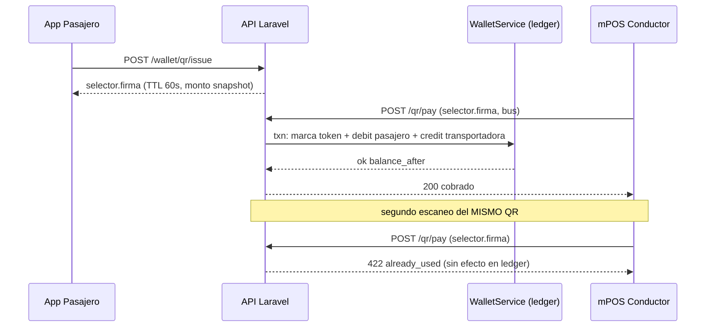

# 🔁 FLOWS — Secuencias del sistema de pago (pasajero ↔ conductor ↔ plataforma)

> M2 · S2.3.4 · Preconditiones de datos: `DB_SCHEMA_PAYMENTS.md`. Reglas de seguridad: `.opencode/docs/qr-nfc-token-security.md`, cuellos: `BOTTLENECKS.md §2/§4/§5`. Endpoints objetivo conviven con `/qr/validate` legacy hasta el fin de F3 (contrato de app instalada).

## F1. Recarga de wallet

**⚠️ Pendiente proveedor de pagos externos (API keys = decisión del usuario, fuera de esta misión).** Sustituto actual (dev/demo):
1. Pasajero autenticado → `POST /api/v1/wallet/recharge-mock` (solo `local`/`testing`).
2. `WalletService::credit(user, monto, reference='mock_'.uuid, contraparte='mock')` en transacción: lock → UPDATE saldo+version → INSERT asiento `credit` con `balance_after`.
3. El mismo canal servirá para el webhook del proveedor real (F4): el `reference` único hace el webhook idempotente.
- Alternativa admin: Super Admin registra un asiento `ajuste` desde el panel (nunca edita saldo a mano).

## F2. Emisión de QR dinámico (pasajero)

1. Pasajero abre "Mi QR" → `POST /api/v1/wallet/qr/issue` (`auth:sanctum`, `throttle:10,1`).
2. Server resuelve tarifa vigente (del bus/ruta si se conoce, o default del tenant; fallback global), congela `monto_snapshot_centavos`.
3. Genera selector aleatorio 16 B (nunca se persiste en claro) + firma HMAC-SHA256(`app.key`, `selector|user_id|exp`).
4. INSERT `qr_payment_tokens` (`token_hash=SHA256(selector)`, `expires_at=now+60s`, `used_at=NULL`).
5. App pinta QR con contenido `selector.firma`; rota cada ≤60 s (imagen vieja muerta por TTL).
6. Saldo insuficiente → 422 "recarga para continuar" (no se emite token).

## F3. Cobro a bordo (conductor mPOS)

1. Conductor escanea (`frontend` zxing, cooldown 2.5 s ya existe) → `POST /api/v1/qr/pay` (`auth:sanctum`, `role:admin,driver`, `throttle:60,1`) con selector+firma+bus.
2. En UNA `DB::transaction`:
   a. Recalcular HMAC y comparar → firma inválida = 422 `tampered` (404 silencioso si el hash no existe).
   b. `UPDATE qr_payment_tokens SET used_at=now, used_by_driver_id=? WHERE id=? AND used_at IS NULL` → `affected=0` ⇒ replay ⇒ 422 `already_used`.
   c. `WalletService::debit(pasajero, monto_snapshot, reference='qrpay:{token_id}')` — lockForUpdate + guarda `balance>=monto`; falla → rollback total (marca de uso se revierte).
   d. `credit` a la cuenta `transportadora:{id}` (o plataforma si tenant NULL) mismo `reference`-grupo → **aforo/recaudo quedan conciliables**.
3. Respuesta: `ok | monto | saldo restante enmascarado | balance_after` (el conductor no ve historial del pasajero).
4. Latencia objetivo <150 ms server-side (`BOTTLENECKS.md §2`).

## F4. Replay / doble escaneo / fallos

| Caso | Defensa | Resultado |
|---|---|---|
| Mismo QR escaneado 2× | `used_at` UPDATE-condicional (primera marca gana) | 422 `already_used`, sin doble débito |
| QR viejo (>60 s) | `expires_at` server-authoritative (ignora `ts` del cliente) | 422 `expired` |
| QR editado/falsificado | HMAC con `app.key` + `token_hash` único | 422 `invalid_signature` |
| Reintento de red sobre cobro ok | `reference` UNIQUE ledger (idempotencia) | devuelve asiento existente, saldo no cambia 2× |
| Saldo insuficiente entre emisión y cobro | débito atómico con guarda + `CHECK(balance>=0)` | 422 `insufficient_funds`, rollback |
| Relojes desincronizados | TTL se evalúa SOLO en server; tolerancia ±10 s solo para validación offline del conductor | n/a en online |

## F5. NFC futuro (reutilización de superficie)

Mismo par emisor/liquidador: `POST /wallet/qr/issue` pasa a emitir ALSO un payload NFC (mismo selector+firma TTL en NDEF); el mPOS del conductor cambia de lector (zxing → `NfcAdapter`) pero `POST /qr/pay` **no cambia de contrato** — la verificación, el one-time y el ledger son idénticos. Por eso el diseño no ata nada al medio óptico (decisión registrada en `ARCHITECTURE.md ADR-005`). Fase F4 del roadmap; sin trabajo ahora.

## Diagrama maestro (2 abordajes + replay)

